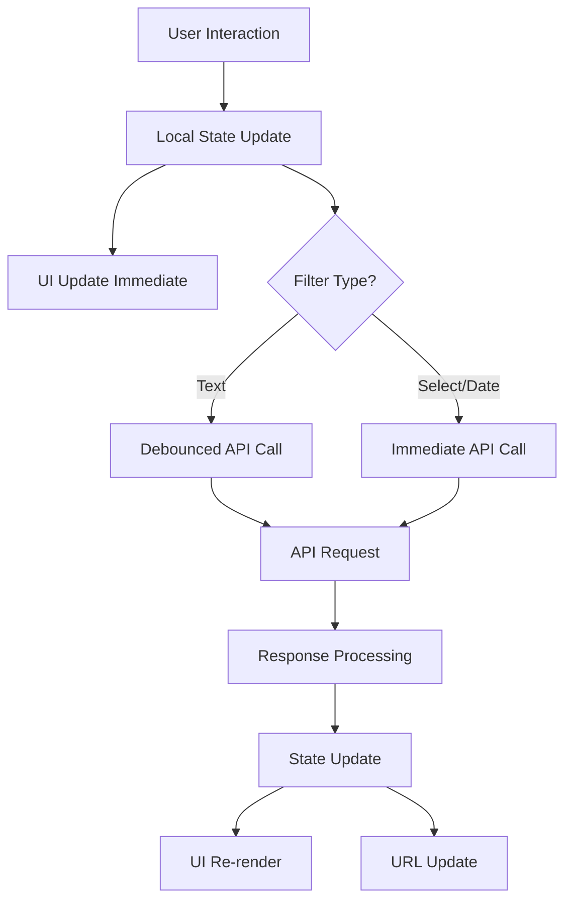

# Design Document

## Overview

The Custom DataTable component will be a complete replacement for the current ag-grid implementation, designed to eliminate the infinite API call loops, filter state synchronization issues, and performance problems that have been plaguing the admin panel. This component will be built from the ground up using React, TypeScript, and our existing UI component library.

The design follows a modular architecture with clear separation of concerns, ensuring maintainability and testability while providing a seamless developer experience that matches the current DataTable API.

## Architecture

### Component Hierarchy

```
CustomDataTable (Main Container)
├── TableFilters (Filter Controls)
│   ├── TextFilter
│   ├── SelectFilter
│   ├── DateFilter
│   └── FilterActions (Clear, Export)
├── TableHeader (Column Headers & Sorting)
├── TableBody (Data Rows)
│   ├── TableRow
│   │   ├── TableCell
│   │   └── ActionCell
│   └── EmptyState
├── TablePagination (Page Controls)
└── LoadingOverlay / ErrorBoundary
```

### State Management Architecture

The component will use a custom hook `useCustomTableState` that provides:

1. **Local State Management**: Immediate UI updates for filters and interactions
2. **URL State Synchronization**: Persistent state across page refreshes
3. **API State Management**: Debounced and optimized server communication
4. **Cache Management**: Intelligent data caching to prevent unnecessary requests

### Data Flow



## Components and Interfaces

### Core Component Interface

```typescript
interface CustomDataTableProps<T = Record<string, unknown>> {
  // Data Configuration
  endpoint: string;
  columns: DataTableColumn[];
  
  // Feature Configuration
  filters?: FilterConfig[];
  actions?: ActionConfig<T>[];
  defaultSort?: { field: string; direction: "asc" | "desc" };
  
  // Display Configuration
  pageSize?: number;
  exportEnabled?: boolean;
  selectionEnabled?: boolean;
  searchEnabled?: boolean;
  
  // Styling
  className?: string;
  height?: string | number;
  
  // Event Handlers
  onRowClick?: (row: T) => void;
  onRowSelect?: (selectedRows: T[]) => void;
  onFiltersChange?: (filters: Record<string, unknown>) => void;
  onExport?: (data: T[]) => void;
  
  // Advanced Configuration
  virtualScrolling?: boolean;
  stickyHeader?: boolean;
  debugMode?: boolean;
}
```

### Column Configuration

```typescript
interface DataTableColumn {
  field: string;
  headerName: string;
  
  // Display
  width?: number;
  minWidth?: number;
  maxWidth?: number;
  align?: "left" | "center" | "right";
  
  // Behavior
  sortable?: boolean;
  resizable?: boolean;
  pinned?: "left" | "right";
  
  // Rendering
  cellRenderer?: (value: any, row: any) => React.ReactNode;
  valueFormatter?: (value: any) => string;
  valueGetter?: (row: any) => any;
  
  // Styling
  headerClassName?: string;
  cellClassName?: string | ((value: any, row: any) => string);
}
```

### Filter System

```typescript
interface FilterConfig {
  field: string;
  type: "text" | "select" | "date" | "dateRange" | "number";
  label: string;
  
  // Configuration
  placeholder?: string;
  options?: Array<{ value: string; label: string }>;
  debounceMs?: number; // Default: 300 for text, 0 for others
  
  // Validation
  validator?: (value: any) => boolean;
  
  // Rendering
  width?: string;
  className?: string;
}
```

### State Management Hook

```typescript
interface UseCustomTableStateOptions {
  endpoint: string;
  defaultPageSize?: number;
  defaultSort?: { field: string; direction: "asc" | "desc" };
  cacheTimeout?: number; // Default: 5 minutes
}

interface CustomTableState {
  // Data State
  data: T[];
  loading: boolean;
  error: string | null;
  total: number;
  
  // Pagination State
  page: number;
  pageSize: number;
  totalPages: number;
  
  // Sorting State
  sortBy?: string;
  sortDir?: "asc" | "desc";
  
  // Filter State
  filters: Record<string, any>;
  localFilters: Record<string, any>; // For immediate UI updates
  
  // Selection State
  selectedRows: Set<string>;
  
  // Actions
  updateFilters: (filters: Record<string, any>) => void;
  updateSort: (field: string, direction: "asc" | "desc") => void;
  updatePagination: (page: number, pageSize?: number) => void;
  clearFilters: () => void;
  selectRow: (id: string) => void;
  selectAllRows: () => void;
  clearSelection: () => void;
  refetch: () => void;
}
```

## Data Models

### API Request/Response Format

The component will maintain compatibility with the existing API format:

```typescript
// Request Parameters
interface TableRequest {
  page?: number;
  pageSize?: number;
  sortBy?: string;
  sortDir?: "asc" | "desc";
  filter_[fieldName]?: string;
  export?: "csv";
}

// Response Format
interface TableResponse<T> {
  success: boolean;
  message?: string;
  data: {
    rows: T[];
    page: number;
    pageSize: number;
    total: number;
    totalPages: number;
  };
}
```

### Internal Data Models

```typescript
interface TableCache<T> {
  key: string;
  data: T[];
  total: number;
  timestamp: number;
  filters: Record<string, any>;
  sort: { field?: string; direction?: "asc" | "desc" };
}

interface FilterState {
  applied: Record<string, any>; // Filters applied to API
  pending: Record<string, any>; // Filters pending API call
  local: Record<string, any>;   // Local filters for immediate UI
}
```

## Error Handling

### Error Boundary Implementation

```typescript
interface TableErrorBoundaryState {
  hasError: boolean;
  error: Error | null;
  errorInfo: ErrorInfo | null;
}

class TableErrorBoundary extends Component<Props, TableErrorBoundaryState> {
  // Comprehensive error catching and recovery
  // Fallback UI with retry functionality
  // Error reporting for debugging
}
```

### API Error Handling

1. **Network Errors**: Automatic retry with exponential backoff
2. **Validation Errors**: Display user-friendly messages
3. **Server Errors**: Graceful degradation with retry options
4. **Timeout Errors**: Cancel requests and show timeout message

### Error Recovery Strategies

- **Stale Data**: Show cached data with error indicator
- **Partial Failures**: Allow partial functionality to continue
- **Retry Logic**: Smart retry with circuit breaker pattern
- **Fallback States**: Meaningful empty states and error messages

## Testing Strategy

### Unit Testing

1. **Component Testing**: Each sub-component tested in isolation
2. **Hook Testing**: State management logic thoroughly tested
3. **Utility Testing**: Helper functions and formatters tested
4. **Error Handling**: Error scenarios and recovery tested

### Integration Testing

1. **API Integration**: Mock API responses and error conditions
2. **State Synchronization**: URL state persistence tested
3. **Filter Interactions**: Complex filter combinations tested
4. **Performance Testing**: Large dataset rendering tested

### End-to-End Testing

1. **User Workflows**: Complete user journeys tested
2. **Cross-browser Testing**: Compatibility across browsers
3. **Accessibility Testing**: Screen reader and keyboard navigation
4. **Performance Testing**: Memory leaks and performance metrics

### Test Structure

```typescript
describe('CustomDataTable', () => {
  describe('Rendering', () => {
    // Basic rendering tests
  });
  
  describe('Filtering', () => {
    // Filter functionality tests
    // Debouncing tests
    // State synchronization tests
  });
  
  describe('Sorting', () => {
    // Sort functionality tests
    // Multi-column sorting tests
  });
  
  describe('Pagination', () => {
    // Page navigation tests
    // Page size changes tests
  });
  
  describe('Selection', () => {
    // Row selection tests
    // Bulk selection tests
  });
  
  describe('Export', () => {
    // CSV export tests
    // Filtered export tests
  });
  
  describe('Error Handling', () => {
    // API error tests
    // Network failure tests
    // Recovery tests
  });
  
  describe('Performance', () => {
    // Large dataset tests
    // Memory leak tests
    // Re-render optimization tests
  });
});
```

## Performance Optimizations

### Rendering Optimizations

1. **React.memo**: Memoize components to prevent unnecessary re-renders
2. **useMemo/useCallback**: Memoize expensive calculations and functions
3. **Virtual Scrolling**: For large datasets (optional feature)
4. **Lazy Loading**: Load data as needed for better initial performance

### State Management Optimizations

1. **Debounced Updates**: Prevent API spam from text inputs
2. **Request Deduplication**: Prevent duplicate API calls
3. **Intelligent Caching**: Cache responses with smart invalidation
4. **Optimistic Updates**: Update UI immediately for better UX

### Bundle Size Optimizations

1. **Tree Shaking**: Only import used utilities
2. **Code Splitting**: Lazy load optional features
3. **Minimal Dependencies**: Use existing UI components
4. **Efficient Algorithms**: Optimized sorting and filtering

## Accessibility Features

### ARIA Implementation

```typescript
// Table structure with proper ARIA roles
<div role="table" aria-label="Data table">
  <div role="rowgroup" aria-label="Table headers">
    <div role="row">
      <div role="columnheader" aria-sort="ascending">
        Column Name
      </div>
    </div>
  </div>
  <div role="rowgroup" aria-label="Table data">
    <div role="row" aria-selected="false">
      <div role="cell">Cell Data</div>
    </div>
  </div>
</div>
```

### Keyboard Navigation

1. **Tab Navigation**: Logical tab order through interactive elements
2. **Arrow Keys**: Navigate between cells and rows
3. **Enter/Space**: Activate buttons and select rows
4. **Escape**: Cancel operations and close dialogs
5. **Home/End**: Navigate to first/last items

### Screen Reader Support

1. **Live Regions**: Announce dynamic content changes
2. **Descriptive Labels**: Clear labels for all interactive elements
3. **Status Updates**: Announce loading states and errors
4. **Table Navigation**: Proper table structure for screen readers

## Integration Points

### Theme Integration

The component will integrate seamlessly with the existing AdminTheme system:

```typescript
const useTableTheme = () => {
  const { isDark } = useAdminTheme();
  
  return {
    tableClasses: isDark ? 'dark-table' : 'light-table',
    cellClasses: isDark ? 'dark-cell' : 'light-cell',
    headerClasses: isDark ? 'dark-header' : 'light-header',
    // ... other theme-specific classes
  };
};
```

### API Integration

The component will use the existing `apiClient` from `@/lib/axios` and maintain compatibility with current API endpoints and response formats.

### Notification Integration

Error messages and success notifications will integrate with the existing notification system used throughout the admin panel.

### Authentication Integration

The component will work seamlessly with existing admin authentication and protection middleware.

## Migration Strategy

### Phase 1: Core Component Development
- Build basic table structure and rendering
- Implement pagination and sorting
- Add basic filtering functionality

### Phase 2: Advanced Features
- Add selection and bulk actions
- Implement export functionality
- Add accessibility features

### Phase 3: Performance & Polish
- Add virtual scrolling for large datasets
- Implement advanced caching
- Performance optimizations

### Phase 4: Migration
- Replace ag-grid usage page by page
- Maintain backward compatibility during transition
- Remove ag-grid dependencies after complete migration

## Security Considerations

1. **Input Sanitization**: All filter inputs sanitized before API calls
2. **XSS Prevention**: Proper escaping of user-generated content
3. **CSRF Protection**: Integration with existing CSRF protection
4. **Rate Limiting**: Respect existing API rate limits
5. **Data Validation**: Client-side validation with server-side verification

## Monitoring and Debugging

### Debug Mode

```typescript
interface DebugInfo {
  apiCalls: Array<{ timestamp: number; url: string; params: any }>;
  renderCount: number;
  cacheHits: number;
  cacheMisses: number;
  errorCount: number;
}
```

### Performance Monitoring

1. **Render Performance**: Track component render times
2. **API Performance**: Monitor request/response times
3. **Memory Usage**: Track memory consumption
4. **Error Rates**: Monitor error frequency and types

This design provides a robust, performant, and maintainable solution that addresses all the issues with the current ag-grid implementation while maintaining compatibility with existing code and providing enhanced functionality.